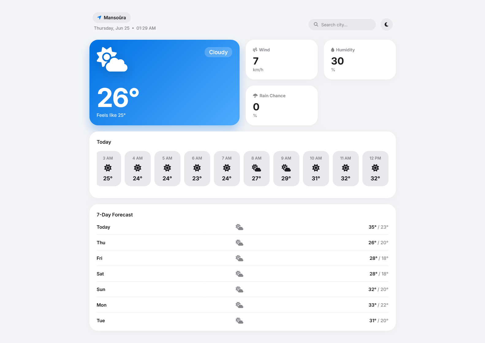

# 🌦️ Weathery — Modern Weather Forecast Web App

A modern and responsive weather application that provides accurate real-time weather information through a clean and intuitive interface.

Designed with a strong focus on UI/UX, responsiveness, and API integration, Weathery delivers a smooth weather experience across desktop and mobile devices.

---

## ✨ Features

- 🌍 Search weather by any city
- 📍 Automatic location detection
- 🌡️ Real-time temperature
- 🥵 "Feels Like" temperature
- 🌤️ Current weather conditions
- 💨 Wind speed
- 💧 Humidity
- ☔ Rain probability
- 🕒 Hourly forecast
- 📅 7-Day weather forecast
- 🌙 Dark / Light mode
- 📱 Fully responsive design

---

## 🛠 Tech Stack

- HTML5
- CSS3
- JavaScript (ES6)
- OpenWeather API

---

## 📸 Screenshots

### Home Dashboard


---

## 🎯 Project Goals

This project was built to strengthen frontend development skills while practicing:

- API Integration
- Fetch API
- Asynchronous JavaScript
- Responsive Layouts
- Modern UI/UX
- Component-Based Design

---

## 📂 Project Structure

```
├── index.html
├── style.css
├── script.js
└── showcase/
```

---

## 🚀 Live Demo

Coming Soon...

---

## 👨‍💻 Author

**Mohamed Soliman**

Software Engineer • Cybersecurity Student

GitHub:
https://github.com/Mohammmedsoliman

---

## ⚠️ Intellectual Property Notice

This project is an original work created and owned by **Mohamed Soliman**.

The source code, UI/UX design, project structure, and visual assets are published for **portfolio and educational purposes only**.

Copying, redistributing, modifying, or commercially using any part of this project without prior written permission is prohibited.

© 2026 Mohamed Soliman. All Rights Reserved.
